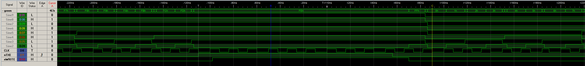

# icoboard_yosys_demos
Some icoboard demo projects with the icestorm toolchain

## Icoboard

http://icoboard.org/

## yosys

http://www.clifford.at/icestorm/

## baseboard with ft232h

https://shop.trenz-electronic.de/de/TE0889-03-icoUSBaseboard-FTDI-Interfacebasis-fuer-das-icoBoard?c=472


## ft 232h driver install

https://www.ftdichip.com/Drivers/D2XX.htm

https://www.youtube.com/watch?v=jynlynjOOek&feature=youtu.be

```bash
tar -xvf libftd2xx-x86_64-1.4.8.gz 
sudo cp release/build/lib* /usr/local/lib
cd /usr/local/lib/
sudo ln -s libftd2xx.so.1.4.8 libftd2xx.so
sudo chmod 0755 libftd2xx.so.1.4.8 
sudo rmmod ftdi_sio
sudo rmmod usbserial
```

## flash fpga and and start reading counter values


```bash
./run.sh
./make.sh > dump.txt
```


## FTDI 245 FIFO Tutorial with Visual Studio and a Lattice MachXO2 FPGA

http://www.farrellf.com/projects/software/2020-04-18_FTDI_Sync_245_FIFO_Tutorial__D2XX_with_Visual_Studio_2019/

https://www.youtube.com/watch?v=z1FYU4kR7qw

## solution to avoid losing around each 510 byte

With great FTDI support I have solved problem TXE signal can go HIGH on falling edge of clock and so it must not be checked only on rising edge.

https://community.intel.com/t5/Programmable-Devices/FT2232H-245-Synchronous-FIFO-Mode-problem/td-p/111192


## logic analyzer logs

Trigger is on rising edge of nTXE, as you can see it is direct at the falling clk edge

baseboard_ft245_counter_demo_losing_bytes



baseboard_ft245_counter_demo_fixed


## still missing one byte?

yes have no clue why till now, if you found something or have an idea please share
